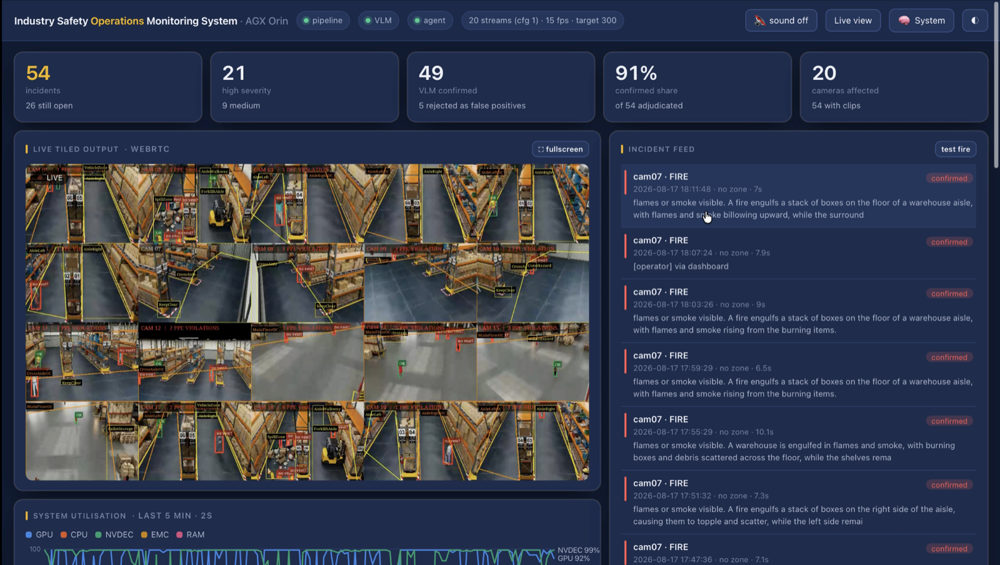
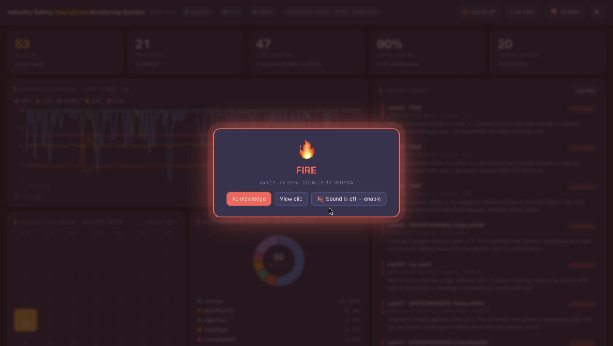
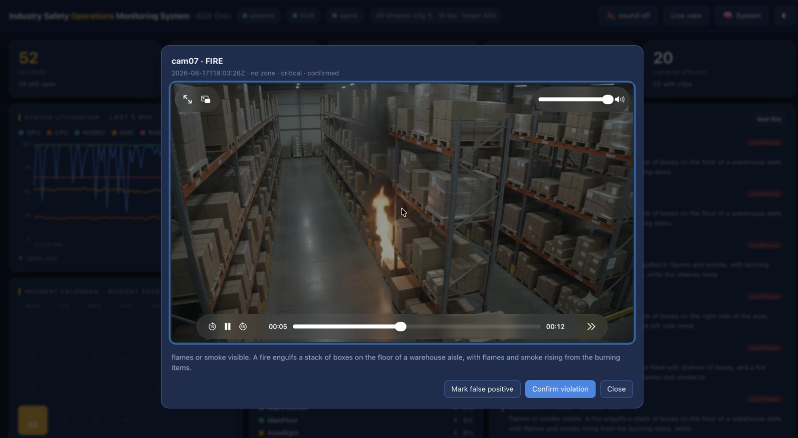
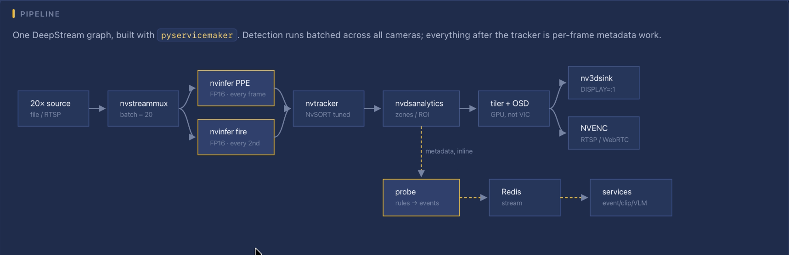

# Industry Safety Operations Monitoring System

This tree is the **NVIDIA DGX Spark** port of
[atomicrajat/industry_safety_monitoring_system](https://github.com/atomicrajat/industry_safety_monitoring_system).
The original project is a 20-camera PPE and fire pipeline; here the same system runs in Docker on
GB10 (ARM SBSA, Blackwell), not as a host install.

Real-time PPE compliance and fire/smoke detection across **20 concurrent 1080p30 camera streams**
on a single DGX Spark. Detection, tracking, zone analytics, evidence clips, vision-language
verification, a natural-language agent and phone alerts — all on the box, with nothing leaving it.



The operator dashboard: KPI tiles, the live 20-camera WebRTC wall with detections and zone
overlays, the incident feed, and system utilisation. Click a tile to fill the 1080p encode with
that camera (`nvmultistreamtiler` `show-source`); the wall button restores the mosaic.

---

## What it does

A camera sees a worker without a helmet. Within a second that violation is an incident on the
operator dashboard. Two seconds later an evidence clip is cut from the source video. A local
vision-language model then looks at the clip and confirms or rejects the finding — and if it spots
a fire nobody asked it about, it raises that as its own alert. If the incident clears the
notification policy, it arrives on a phone with the video attached.

| Layer | What happens |
|---|---|
| **Detect** | Two YOLO detectors per frame: PPE (helmet / vest / person) and fire/smoke |
| **Track** | NvSORT assigns stable per-person IDs so a single bad frame cannot flip a verdict |
| **Reason about zones** | Per-camera polygons — a missing vest is `medium` in a walkway and `high` in a forklift route. Live USB/IP cameras do not inherit the demo warehouse floor plan |
| **Turn into incidents** | An event is a state *transition*, not a frame observation. 2225 observations → 6 incidents |
| **Capture evidence** | An H.265 clip cut from the source at the incident timestamp, no re-encode |
| **Verify** | Cosmos Reason 2 answers perception questions; the verdict is computed in code |
| **Alert** | Dashboard toast and alarm, plus Telegram with the clip — under a policy for what is worth interrupting someone for |
| **Ask** | Nemotron Nano 9B answers questions over the incident database, grounded in SQL |

### An alert, end to end

<table>
<tr>
<td width="50%"></td>
<td width="50%"></td>
</tr>
<tr>
<td><b>Fire raises a full-viewport alarm</b> with a Web Audio siren — no asset to fetch. Audio
needs a user gesture, hence the explicit sound toggle, and <code>prefers-reduced-motion</code>
disables every animation, because a full-screen red flash is exactly the effect that can harm.</td>
<td><b>The evidence clip, with the model's finding first.</b> Cut from the source at the incident
timestamp and transcoded to H.264 on demand, because browsers cannot decode H.265. The operator
can confirm the violation or mark it a false positive.</td>
</tr>
</table>

### Measured on this Spark

Numbers below are from the live stack on the DGX Spark that runs this tree: 20 RTSP sources
(`drop_frame_interval: 2` → 15 fps analytics per camera, **300 fps** needed to keep pace), full
reasoning containers up, dashboard on `:9080`.

| | |
|---|---|
| Analytics target | **300 fps** (20 × 15) |
| Pipeline aggregate (running average) | **~289 fps** — keeps up with the paced sources |
| GPU (nvidia-smi snapshot) | **~94%** |
| Stack | pipeline, events, clips, Cosmos Reason 2, Nemotron — all answering |

File-mode decode-ceiling sweeps and alert-latency medians in [`bench/`](bench/) were recorded on
the original hardware; they are not re-quoted here as Spark figures. Re-run those scripts on this
box if you need Spark-specific ceilings.

Sources on this rig are restreamed from one host, so ingest can still drop a batch that misses
the muxer window. Separate physical cameras do not share that NIC.

---

## Architecture



One DeepStream graph built with `pyservicemaker`. Detection runs batched across all cameras;
everything after the tracker is per-frame metadata work. The probe attaches to the **tracker**,
the last per-stream element — after the tiler, all cameras have been composited into a single
frame and per-stream state is silently wrong.

From there the metadata leaves the pipeline over Redis, and the services that consume it —
incident store, clip capture, VLM adjudication, notifications, API — run as separate processes
that cannot stall the hot path. Verified: stopping Redis under a running pipeline leaves fps flat
and publishing resumes by itself.

The same diagram, with hardware detail, per-model throughput and the full service map, is on the
dashboard's `/system` page.

---

## Hardware — DGX Spark

Spark is **ARM SBSA**, not Tegra. There is no JetPack, no DLA, no `nv3dsink`, and the Tegra
DeepStream image fails looking for `libnvbufsurface`. Do not treat `uname -m` → `aarch64` as a
reason to install the Jetson stack.

This deployment was checked on:

| | This Spark |
|---|---|
| Chassis | NVIDIA DGX Spark (`NVIDIA_DGX_Spark` in DMI) |
| GPU | NVIDIA GB10, compute **12.1** (`sm_121`) |
| Driver / CUDA | **580.173.02** / **13.0** |
| Memory | **128 GB** unified (`nvidia-smi memory.total` reports `[N/A]`; the dashboard charts system RAM, which is the pool the GPU draws from) |
| DeepStream | **9.1.0** image `nvcr.io/nvidia/deepstream:9.1-triton-sbsa-dgx-spark` |
| TensorRT | **10.16.1.11** (CUDA 13.2 packages inside that image) |
| Display sink | `nveglglessink` |
| llama.cpp | CUDA **13**, `CMAKE_CUDA_ARCHITECTURES=121` |
| nvinfer | `strongly-typed: 1` (Blackwell) |
| Subject crops | omitted (`WITH_RGB_CAPTURE=0`) — no CUDA torch in the image; the VLM uses context frames |
| Dashboard | **`:9080`** (Label Studio typically already owns `:8080`) |

Need ~60 GB free for the image, ~11 GB of GGUF weights, engines, and clip budget. Disk on this
host is not the constraint.

```bash
./scripts/check_hardware.sh
```

It reports PASS / WARN / FAIL and must identify the platform as **sbsa**, not Jetson.

---

## Quick start

Docker and the NVIDIA Container Toolkit, with a GPU the toolkit can see:

```bash
nvidia-smi -L   # expect: NVIDIA GB10
```

```bash
git clone <your-fork-url> industry_safety_monitoring_system
cd industry_safety_monitoring_system

# Footage is gitignored. Copy cam01.mp4 … cam20.mp4 into media/, or build a set:
#   ./scripts/docker_up.sh --profile media run --rm media

# Optional credentials (HF_TOKEN, Telegram) — see below
cp .env.example .env && chmod 600 .env

./scripts/docker_up.sh
```

That is:

```bash
docker compose -f docker/compose.yml -f docker/compose.spark.yml up --build -d
```

Then **http://\<spark\>:9080/**.

First boot pulls the SBSA DeepStream image, builds TensorRT engines for `sm_121`, and compiles
llama.cpp with CUDA 13. A binary built for `80;86;89;90` under CUDA 12.6 will load on GB10 and
then fail every kernel launch.

`scripts/setup.sh` is the original host-install path. Do not run it on Spark expecting DeepStream
to appear on the host — it arrives in the SBSA container.

### Put the footage in place

`media/` is gitignored. Names are the contract: `media/cam01.mp4 … cam20.mp4`, and the number
**is** the camera id that `configs/analytics/zones.yml`, the OSD label, the clip prefixes and the
dashboard all key on. Each clip is 1920×1080, 30 fps, H.265.

To build a set from your own footage, drop it in `media/src/` and:

```bash
./scripts/docker_up.sh --profile media run --rm media
```

That re-encodes through `hevc_nvenc`. With `media/src/` empty it falls back to the H.265 sample
DeepStream ships, which contains no helmets, vests or fire.

### Three source modes

They differ only in where the video comes from.

| | Source | Evidence clips | Use |
|---|---|---|---|
| **A** | files in `media/` | `ffmpeg -c copy` from the `.mp4` | demos, repeatable numbers |
| **B** | those files, served as RTSP | `nvurisrcbin` smart record | live path, no cameras |
| **C** | real cameras (and/or a USB webcam) | smart record | production / this Spark |

#### A. Video files

```bash
./scripts/docker_up.sh up -d --build
```

20 file sources from `media/`, run flat out.

#### B. The same files, as RTSP

```bash
ISMS_SOURCE=rtsp ISMS_RTSP_BASE=rtsp://127.0.0.1:8654 \
  ./scripts/docker_up.sh --profile sources up -d
```

Realtime-paced: 20 cameras at `drop_frame_interval: 2` need 300 fps of analytics; keeping pace
near 300 fps is the expected result, not a ceiling. Recreate the app after changing `docker/.env`
(`restart` keeps the old environment):

```bash
./scripts/docker_up.sh up -d --force-recreate app
```

#### C. Real cameras

Position in the list **is** the camera id:

```bash
ISMS_SOURCE=rtsp \
ISMS_RTSP_URLS="rtsp://user:pw@10.0.0.11/Streaming/Channels/101,rtsp://user:pw@10.0.0.12/axis-media/media.amp" \
  ./scripts/docker_up.sh up -d --force-recreate app
```

A fleet on one server with numbered mounts can use `ISMS_RTSP_BASE` instead. Camera URLs live in
the environment because they carry credentials and `configs/demo.yml` is committed.

Physical cameras (USB webcam path `/webcam`, `v4l2`, or an IP `rtsp://` that is not a numbered
demo restream) do not get the warehouse aisle OSD — those polygons were authored for the demo
clips.

#### USB webcam as CAM 20 (verified on this Spark)

The pipeline does not ingest `/dev/video0` directly. `./scripts/serve_webcam.sh` publishes it as
`rtsp://127.0.0.1:8654/webcam`.

```bash
# docker/.env: ISMS_SOURCE=rtsp, ISMS_STREAMS=20, ISMS_RGB_CAPTURE=0,
# ISMS_RTSP_URLS from:
./scripts/serve_webcam.sh urls 20

./scripts/docker_up.sh --profile sources up -d
./scripts/docker_up.sh up -d --force-recreate app
```

Do not publish the camera to **:8554** — that is the tiled *output*. Leave TensorRT batch at 20;
do not add a 21st stream.

`ISMS_RGB_CAPTURE` must stay **0**. Unset on RTSP would turn subject crops on and the pipeline
dies on `import torch`.

### What runs

Four containers on **host networking**, so `configs/services.yml` still talks to `127.0.0.1`.

| | |
|---|---|
| `redis` | the event bus |
| `app` | pipeline, services, dashboard, mediamtx |
| `vlm` | Cosmos Reason 2 on `:8000` |
| `llm` | Nemotron Nano 9B on `:8001` |

The browser reaches the dashboard (`:9080`) and mediamtx (`:8554` RTSP, `:8889` WebRTC). There is
no authentication in front of them.

Engines are built on first boot and stamped with compute 12.1. Weights land on a named volume.
ONNX is baked in the image.

### Configuration knobs

Two env files, because Compose treats them differently:

| File | Job |
|---|---|
| `docker/.env` | What the deployment **is** — source mode, stream count, camera URLs. Template: `docker/.env.example` |
| `<repo>/.env` | Credentials, via `env_file`. Template: `.env.example` |

An `ISMS_*` value in the repo-root `.env` does not work: Compose interpolates from `docker/`.

| | |
|---|---|
| `ISMS_STREAMS` | cameras, default 20 |
| `ISMS_SOURCE` | `file` or `rtsp` |
| `ISMS_RTSP_URLS` | comma-separated; position is the camera id |
| `ISMS_RTSP_BASE` | numbered mounts |
| `ISMS_WIPE` | wipe incidents on start, default 1 |
| `ISMS_RGB_CAPTURE` | **0** on Spark |
| `ISMS_API_PORT` | overlay sets **9080** |

---

## Bring your own tokens

Nothing ships with credentials. Copy the template if you want Hugging Face or Telegram:

```bash
cp .env.example .env
chmod 600 .env
```

`.env` is gitignored. The file is optional — without it those features stay off. `env_file` is
read at container **creation**; a `.env` written afterwards needs
`./scripts/docker_up.sh up -d --force-recreate app`.

The reasoning layer on Spark serves public GGUF builds
(`robertzty/Cosmos-Reason2-2B-GGUF`, `bartowski/nvidia_NVIDIA-Nemotron-Nano-9B-v2-GGUF`) and
downloads anonymously. `HF_TOKEN` is only needed for a gated repo.

### Hugging Face

1. <https://huggingface.co/settings/tokens> — **read** scope
2. `HF_TOKEN=hf_...` in `.env`

### Telegram (off by default)

1. [@BotFather](https://t.me/BotFather) `/newbot`
2. `./scripts/telegram_setup.sh` or `getUpdates` for the chat id
3. `TELEGRAM_BOT_TOKEN` / `TELEGRAM_CHAT_ID` in `.env`
4. `notify.telegram.enabled: true` in `configs/services.yml`
5. Recreate the app container

Check with `curl http://localhost:9080/notify/status`.

---

## Running it

```bash
./scripts/docker_up.sh                         # start (adds compose.spark.yml on this host)
./scripts/docker_up.sh --profile sources up -d # + restreamers / webcam
./scripts/docker_up.sh --profile sources down  # stop; volumes survive
```

Pause/resume from the dashboard header stops the pipeline process (SIGKILL — TensorRT unloads)
without unloading Cosmos or Nemotron.

| | |
|---|---|
| Dashboard | `http://<spark>:9080/` |
| System reference | `http://<spark>:9080/system` |
| Live flow | `http://<spark>:9080/flow` |
| API browser | `http://<spark>:9080/docs` |
| Tiled wall (RTSP) | `rtsp://<spark>:8554/safety` |
| Live view (WebRTC) | `http://<spark>:8889/safety` |
| Logs | `docker compose … logs -f app` and `logs/` in the app volume |

### Timing to expect

An alert appears in **under a second**. Its evidence clip follows after the smart-record window
(on the order of **10 s** in RTSP mode, because the tail has to elapse). The VLM verdict runs
**serially** — a cold start queue takes a few minutes to drain; steady state keeps up.

### Evidence over RTSP

There is no local source file:

- **Clips** — `nvurisrcbin` smart record from its ring buffer, no re-encode.
- **Subject crops** — not in this image. The VLM uses context frames instead.

---

## Pipeline config

Two files, split by lifecycle.

### `configs/demo.yml`

| Knob | What it does |
|---|---|
| `pipeline.streams` | 1–20 |
| `pipeline.source_mode` | `file` or `rtsp` |
| `pipeline.drop_frame_interval` | `2` = 15 fps analytics. This is what makes the local reasoning layer affordable |
| `pipeline.topology` | `serial` (Spark has no DLA; `parallel` does not pay off) |
| `rules.*.min_confidence` | Never stricter than the detector's `pre-cluster-threshold` |
| `rules.window_frames` / `flip_ratio` | Debouncing |
| `sinks.display` / `sinks.rtsp_out` | Local monitor and/or network output |
| `render.compute_hw` | `gpu` |

### `configs/services.yml`

Redis, the incident store (`realert_after_s`), clip retention, the reasoning endpoints, and the
notification policy.

### The rest

`configs/pgie_ppe.yml` and `pgie_fire.yml` are the detectors. `tracker_nvsort_tuned.yml` is the
tracker — **do not point this at the stock `config_tracker_NvSORT.yml`**, which emits zero objects
while appearing to run faster. `analytics/zones.yml` is the zone geometry;
`scripts/make_zones.py --preview N` renders polygons onto a real frame.

Full field notes: [`project_skill.md`](project_skill.md).

---

## Tests

```bash
./tests/run_all.sh            # everything that can run without a GPU
./tests/run_all.sh --logic    # only the dependency-free tests
```

Nothing in `tests/` talks to a network, a model server, a GPU or a real Redis. See
[`tests/README.md`](tests/README.md).

```bash
python3 tools/inspect_db.py --check-only
```

---

## Models

Downloaded at setup time, not committed.

| Purpose | Model | Source | Licence |
|---|---|---|---|
| PPE / helmet / vest | YOLOv11n, 4 classes | `melihuzunoglu/ppe-detection` | AGPL-3.0 |
| Fire / smoke | YOLOv26s | `SalahALHaismawi/yolov26-fire-detection` | MIT |
| Vision verification | Cosmos Reason 2 (2B) | NVIDIA Open Model (GGUF on Spark) | NVIDIA Open Model |
| Agent | Nemotron Nano 9B v2 | NVIDIA | NVIDIA Open Model |

The PPE model has **no `no-vest` class**, so a vest violation is inferred. The UI reflects that:
`NO HELMET` is definite, `no vest?` is hedged.

---

## Troubleshooting

| Symptom | Cause | Fix |
|---|---|---|
| Pipeline runs fast, zero detections | Stock NvSORT — every target sits in shadow mode | `configs/tracker_nvsort_tuned.yml` |
| `Failed to initilaize low level lib` | Tracker `dlopen`s libmosquitto | Already in the Spark image; do not debug this as a pipeline bug |
| `setDimensions: Error Code 3` | Dynamic-axis ONNX without dims | `infer-dims=3;640;640` |
| `libnvbufsurface` missing | Tegra DeepStream image on Spark | Use `compose.spark.yml` / `./scripts/docker_up.sh` |
| llama.cpp loads then every kernel fails | Built for sm_80–90 / CUDA 12.6 | Overlay builds CUDA 13 / arch **121** |
| Pipeline dies on `import torch` | Subject crops on, no CUDA torch | `ISMS_RGB_CAPTURE=0` |
| Dashboard empty on `:8080` | Label Studio owns that port | Use **`:9080`** |
| Black video in the dashboard | Encode / mediamtx / pipeline | `curl localhost:9080/live/status` |
| Evidence clip is a black rectangle | Browser cannot decode H.265 | `/clips/{id}` transcodes lazily |
| Agent always the same plan, slow | Soft fallback | Check `plan_error` in the response |
| `database is locked` | Write on a read path | `project_skill.md` §6, traps 23 and 27 |
| Empty wall after `down` | Restreamers on `:8654` were stopped | `./scripts/docker_up.sh --profile sources up -d` then recreate `app` |

The full trap list is in [`project_skill.md`](project_skill.md) §6.

---

## Repository layout

```
app/            DeepStream pipeline and the rules that turn detections into events
services/       store, clips, VLM, agent, API, alerts
tools/          database integrity, verdict inspection
tests/          unit tests, none of which need a GPU
scripts/        docker_up, media, webcam, measurement
configs/        pipeline, model, tracker, zone and service configuration
dashboard/      operator UI
models/         labels and the custom TensorRT output parser
bench/          measured results (includes original-tree sweeps)
requirements/   Python dependencies, one file per virtualenv
docker/         Spark overlay (`compose.spark.yml`), images, entrypoint
.claude/skills/ NVIDIA agent skills (DeepStream, VSS, …) shipped unmodified
```

---

## For AI coding assistants

**[`project_skill.md`](project_skill.md)** — architecture, settled constraints, and field notes.
Read it before changing the pipeline.

**[`.claude/skills/`](.claude/skills/)** — NVIDIA DeepStream / VSS reference material with exact
property names. This host is **SBSA / DGX Spark**, not Tegra: do not emit Jetson-only plugins
(`nv3dsink`, DLA, `nvarguscamerasrc`) or treat `aarch64` as Jetson.

---

## Licence

AGPL-3.0 — see [LICENSE](LICENSE).

The PPE detector is a YOLOv11 model and the export path uses Ultralytics, both AGPL-3.0, which is
why this project is too. The NVIDIA agent skills under `.claude/skills/` are NVIDIA's own work
under their own terms and are **not** covered by the AGPL. Full attribution in [NOTICE](NOTICE).

Upstream: [atomicrajat/industry_safety_monitoring_system](https://github.com/atomicrajat/industry_safety_monitoring_system).
